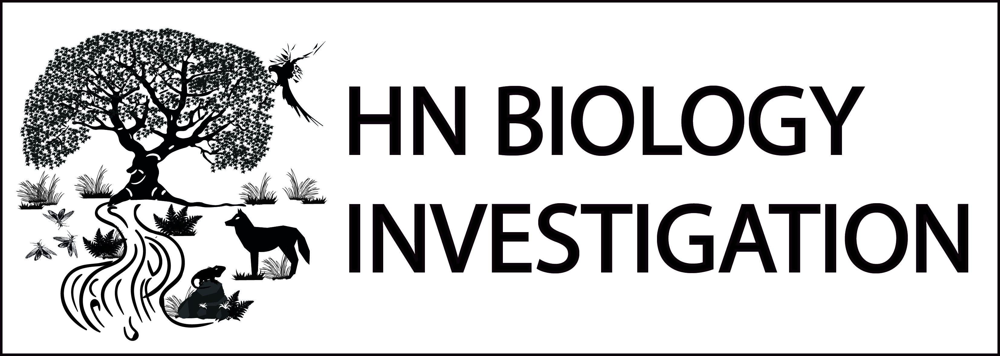

```{r setup, include=FALSE}
knitr::opts_chunk$set(echo = TRUE)
```


Bienvenidos a este curso diseñado para profesionales, estudiantes y personas interesadas en la Ecología. En este curso, exploraremos las técnicas estadísticas utilizadas en el análisis de datos ecológicos y cómo aplicarlas para evaluar la significación de las diferencias entre grupos, identificar patrones y tendencias en los datos y explorar las relaciones entre las variables. A través de ejemplos y ejercicios prácticos, aprenderás a utilizar diferentes métodos estadísticos y a analizar y visualizar los datos de manera efectiva. Si tienes un interés en la Ecología y quieres aprender a utilizar las herramientas estadísticas para analizar tus datos, ¡este curso es para ti!

### Contenido


[Introduccion al curso](Introduccion.html)

[Clase 1: Comandos basicos en R y uso de scripts](Clase1.html)

[Clase 2: Analisis de Diversidad](Clase2.html)

[Clase 3: Analisis de Variaza y Prueba Correlacion](Clase3.html)

[Clase 4: Pruebas no parametricas](Clase4.html)

[Clase 5: Modelos lineales](Clase5.html)

[Clase 6: Modelos lineales Generalizados: Poisson](Clase6.html)

[Clase 7: Modelos lineales Generalizados: Binomial](Clase7.html)

[Clase 8: NMDS, PCA y PERMANOVA](Clase8.html)

[Clase 9: Anosim, MRPP, SIMPER e Indicador de especies](Clase9.html)

[Clase 10: Repaso, Preguntas y respuestas](Clase10.html)





